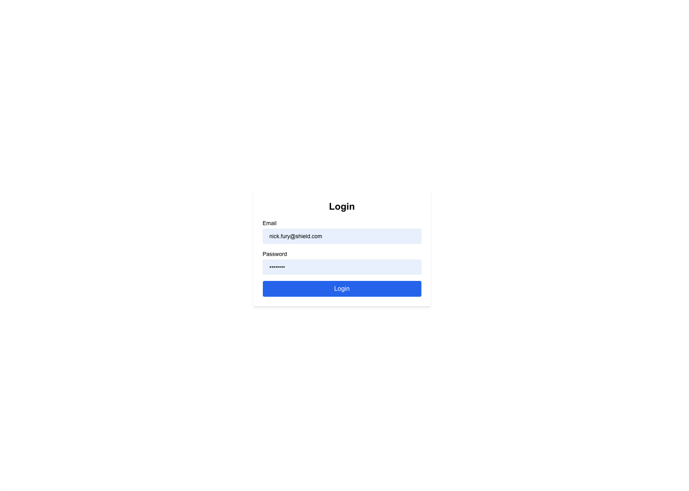
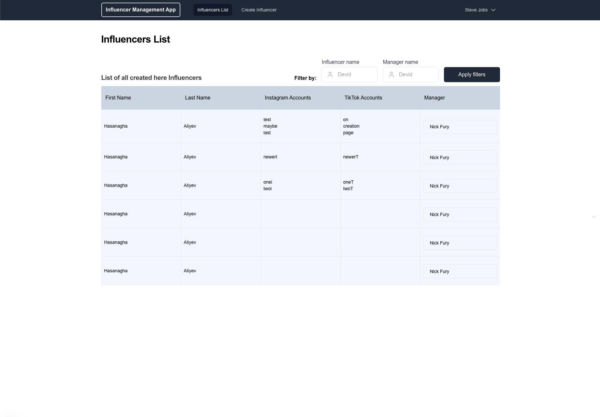
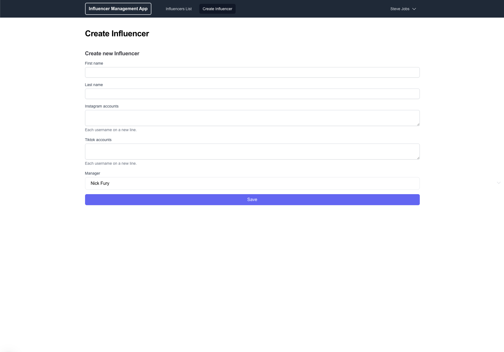

Small app for influencers management.

# Seed Users

1. Email: nick.fury@shield.com  | Password: invasion
2. Email: odin.borson@asgard.com | Password: hela

# How to build and run

## Create .env file

Create .env file in the root. .env file should contain these environment variables

POSTGRES_USER=
POSTGRES_PASSWORD=
POSTGRES_DB=
POSTGRES_PORT=

JWT_SECRET=
JWT_TOKEN_EXPIRES=7d

For prod it can contain also this variable

PROD_DATABASE_URL=

## Build Authentification

Generate a secret key.

openssl rand -base64 32

Store new generated secret key in .env as JWT_SECRET
JWT_SECRET=your_secret_key

##

npm run dev

http://localhost:3000

## Screenshots

