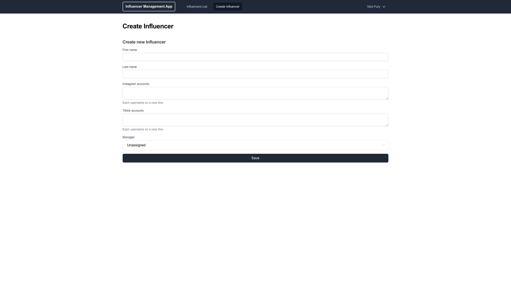

# Influencer Management App

A straightforward application for managing a list of influencers, including their Instagram and TikTok accounts. Managers (app users) can be assigned/reassigned to specific influencers.

---

## Technologies Used  

- **Next.js**: Version 15.0.3 with App Router  
- **React**: Version 19  
- **Tailwind CSS** and **Tigrids** for styling  
- **Jose** for authentication  
- **TypeScript** 

--- 

## Seed Users

These test accounts are available for login:

| Email                        | Password   |
|------------------------------|------------|
| `nick.fury@shield.com`       | `invasion` |
| `odin.borson@asgard.com`     | `hela`     |

---

## Getting Started

### 1. Clone the Repository
```bash
git clone https://github.com/HasanaghaAzad/influencer-management-app.git
cd influencer-management-app
```

### 2. Setup Environment Variables

Create a `.env` file:
```bash
cp .env.example .env
```

Set the following variables:
```env
POSTGRES_USER=
POSTGRES_PASSWORD=
POSTGRES_DB=
POSTGRES_PORT=

JWT_SECRET=
JWT_TOKEN_EXPIRES=7d
```

### 3. Generate a JWT Secret
Use the following command to generate a secure key:
```bash
openssl rand -base64 32
```

Store the generated key in your .env file under the JWT_SECRET variable:

```bash
JWT_SECRET=your_secret_key  
```


For production, include:
```env
PROD_DATABASE_URL=
```

### 4. Install Dependencies

Install required packages:
```bash
npm install
```


### 4. Run the App Locally

Start the development server:
```bash
npm run dev
```

The app will be accessible at:
[http://localhost:3000](http://localhost:3000)

---

## API Overview

### Authentication

**Login**
Send a `POST` request to `/api/login` with the following JSON body:
```json
{
    "email": "YOUR_EMAIL",
    "password": "YOUR_PASSWORD"
}
```
A successful response includes a token:
```json
{
    "token": "YOUR_TOKEN"
}
```

Set Cookies in Postman
If Postman does not automatically set cookies:

Copy the token from the login response.
Manually add a cookie in Postman with the following format:

```
authToken=YOUR_TOKEN; Path=/; HttpOnly;  
```

**Test Authentication**
Use the token to access secure endpoints, like:
```
GET /api/influencers
```

### Influencer Management

**Get All Influencers**
```
GET: /api/influencers
```

**Filter by Influencer Name**
```
GET: /api/influencers?influencerName=NAME
```

**Filter by Manager**
```
GET: /api/influencers?managerName=NAME
```

**Combine Filters**
```
GET: /api/influencers?influencerName=NAME&managerName=NAME
```

---

## Screenshots




